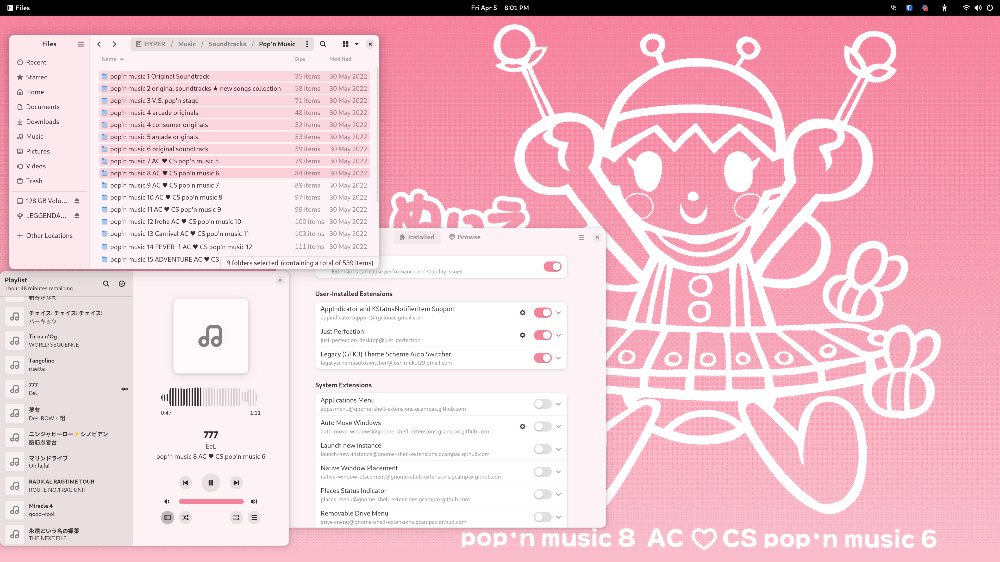
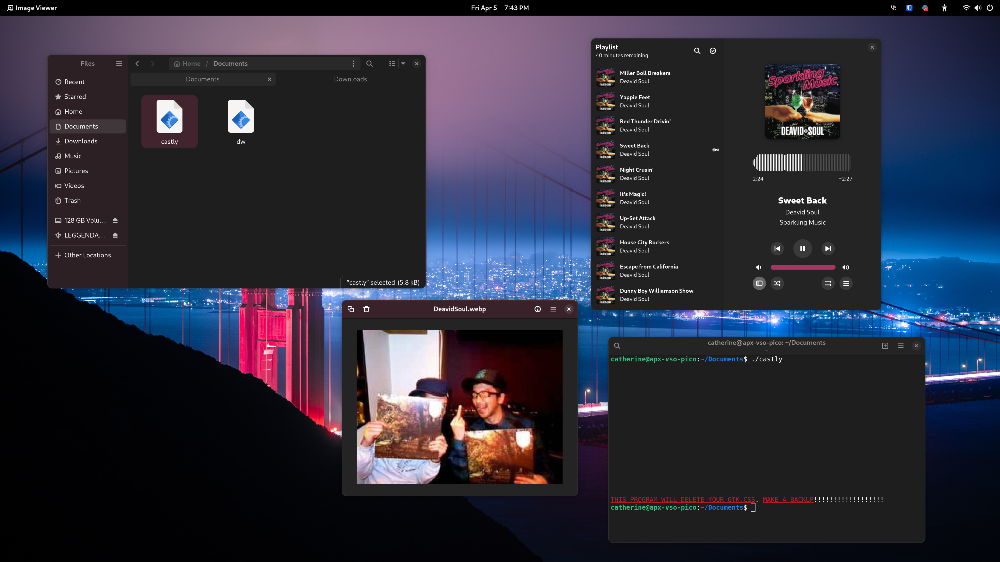

# castly
a bash script to add custom accent colors &amp; tint to GTK4/LibAdwaita &amp; adw-gtk3
  
castly is short for castlycg4laaag3, & is short for Catherine's Awesome Script That Lets You Colorize GTK4/LibAdwaita And Adw-GTK3
  
I made this because I love custom accent colors, and tinting apps with my chosen accent color, but alternatives like Gradience or Material You are just too complicated, and have too many dependancies. The only thing required for this to run is bash, gnu utils, and bc
  
*there is a chance that bc will not come pre-installed on your system. if you get an error referring to "bc," then install bc via your package manager*
  
***THIS PROGRAM WILL DELETE YOUR GTK.CSS. MAKE A BACKUP***
   
# castlim
castlim is an alternative version of castly, made for using in conjunction with [immersive-dark-mode](https://github.com/realmazharhussain/immersive-dark-mode)
  
it creates a light, and dark theme, at the same time, and should be used with immersive-dark-mode to swap between them
  
more info at the bottom of the usage section
   
# usage
castly \<hex> \<mode> \<baseamount (optional)> \<titlebar amount (optional)> \<sidebar amount (optional)>
  
example: castly 95AEA3 bothlight 0.2 0.6 0.4
  
or just: castly 95AEA3 light
  
your hex color should NOT contain #
 
all 3 amount vars are optional (default 0.1, 0.2, 0.175)
  
modes: light, dark, titlelight, titledark, sidebarlight, sidebardark, bothlight, bothdark, no
 
- title<light/dark>: tint the selection accent color & the titlebar
- sidebar<light/dark>: tint the selection accent color & the sidebar
- both<light/dark>: tint the titlebar, sidebar, & the selection accent color
- no: only change the selection accent color

if you set the first amount var, but don't set the other 2, then the titlebar amount defaults to amount\*2, and the sidebar amount defaults to amount\*1.75
    
castlim works slightly differently. the initial usage is the same (hex, mode, amounts), but the syntax is different
  
modes: all, title, sidebar, both, no
 
- all: tint all colors; the background, the titlebar, sidebar, and selection
- title: tint the selection accent color & the titlebar
- sidebar: tint the selection accent color & the sidebar
- both: tint the titlebar, sidebar, & the selection accent color
- no: only change the selection accent color

please make sure that immersive-dark-mode is configured to use gtk-light.css and gtk-dark.css! and if you want support for adw-gtk3, then enable the symlinks in the immersive-dark-mode config!
   
# limitations
- GNOME Shell doesn't use the accent color (i would have to compile an entire shell theme, too many dependencies)
- you have to reload all of your apps for new accent colors to take effect (more info - https://gitlab.gnome.org/GNOME/gtk/-/issues/3409)
- apps that force dark mode may look weird on light themes
- accent colors may not work on non-gtk apps, for example Telegram or KolourPaint
  

Q: castly works on GTK4 apps, but not adw-gtk3; what shall i do?!?!??!?!
 
A: symlink ~/.config/gtk-4.0/gtk.css to ~/.config/gtk-3.0/gtk.css, and everything will work automatically :)
  
Q: castlim works on GTK4 apps, but not adw-gtk3; what shall i do?!?!??!?!
 
A: enable gtk symlinking in immersive-dark-mode!
  
Q: It works on natively-installed apps, but not flatpaks?!?!??!?!
 
A: flatpak override --user --filesystem=xdg-config/gtk-3.0:ro --filesystem=xdg-config/gtk-4.0:ro
  
Q: What's a good app for generating hex codes for my wallpaper?
 
A: I really like Paleta, in combination with Eyedropper, if I need more shades of the same color.
 
https://github.com/nate-xyz/paleta
 
https://github.com/FineFindus/eyedropper
 
 
 
# screenshots

   
THE SOFTWARE IS PROVIDED “AS IS” or some shit idk im not a lawyer
